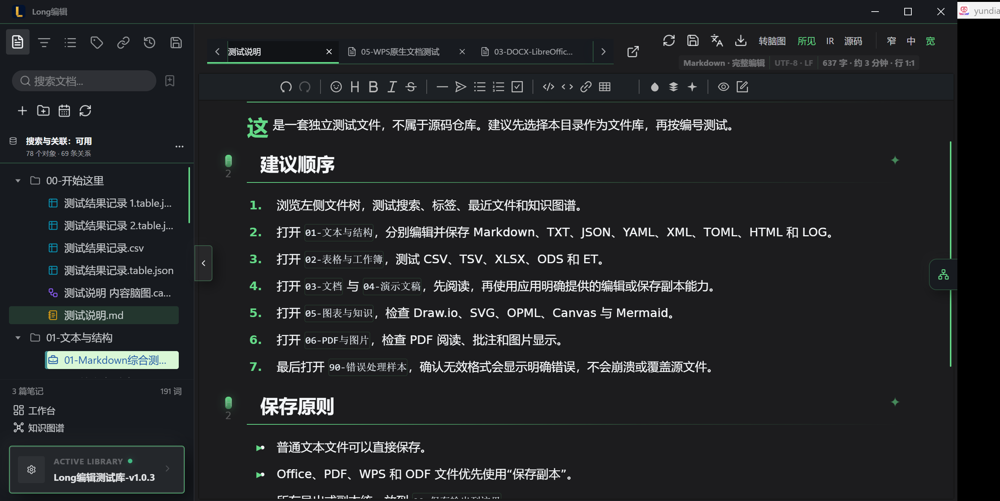
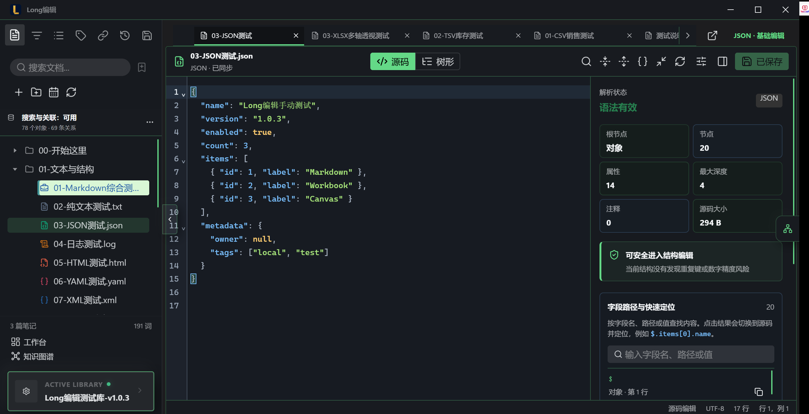
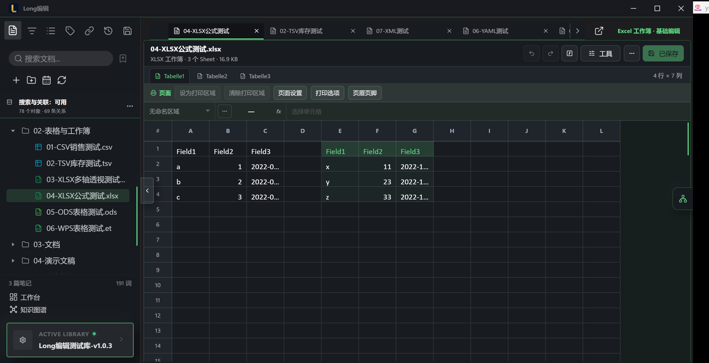
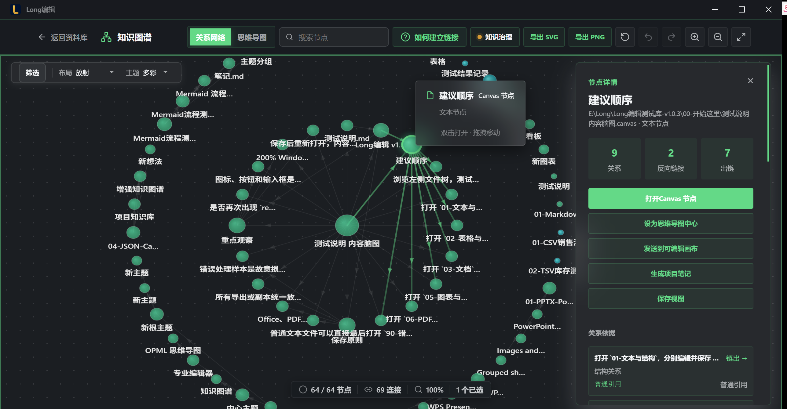
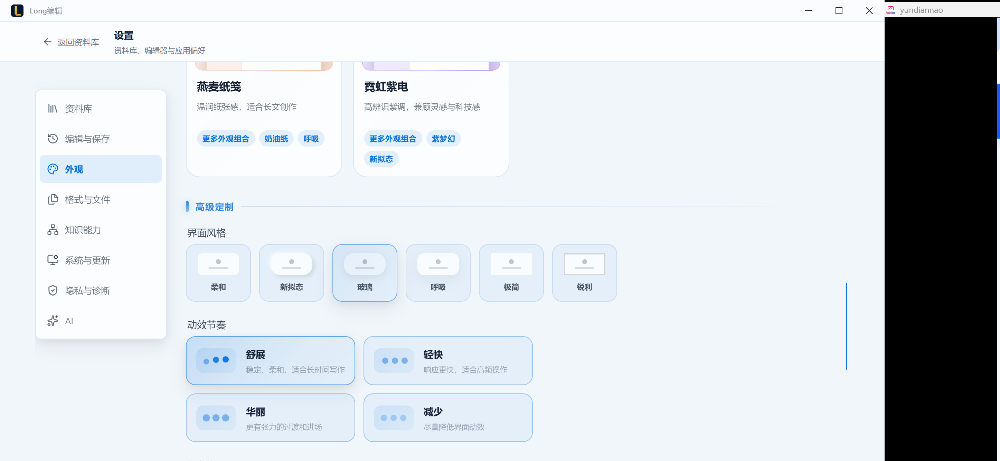
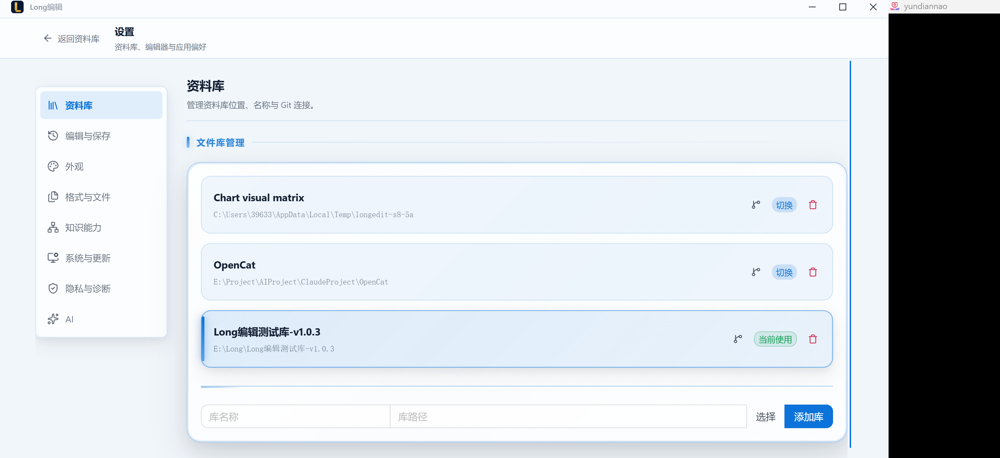

<p align="center">
  
</p>

<h1 align="center">Long编辑</h1>

<p align="center">
  <strong>本地优先的 Windows 知识工作台</strong><br>
  在一个资料库里管理、阅读和编辑文本、表格、Office、PDF、图表、思维导图与媒体文件。
</p>

<p align="center">
  <a href="https://github.com/Longyuyeee/Long_MarkDownReader/releases/tag/v1.0.15"></a>
  
  
  
  
</p>

<p align="center">
  <a href="#下载">下载</a> ·
  <a href="#真实界面">真实界面</a> ·
  <a href="#核心能力">核心能力</a> ·
  <a href="#格式能力">格式能力</a> ·
  <a href="#开发与验证">开发与验证</a>
</p>

<p align="center">
  
</p>

> 截图来自真实安装版与多格式测试资料库。截图中的测试库名称、文件名和示例内容仅用于功能验证，不代表当前软件版本；当前公开版本以本页徽章与 Release 为准。

> v1.0.15 已发布并完成三个公开附件的回下载 SHA-256 复核，集中统一应用提示层、右键菜单、应用内对话框、长格式菜单和更新进度反馈。完整范围见 [v1.0.15 发布说明](docs/RELEASE_NOTES_v1.0.15.md)。

## 下载

Long编辑 v1.0.15 支持 Windows 10/11 x64。

| 安装方式 | 下载 | 适用场景 |
| --- | --- | --- |
| NSIS 安装程序 | [LongEdit_1.0.15_x64-setup.exe](https://github.com/Longyuyeee/Long_MarkDownReader/releases/download/v1.0.15/LongEdit_1.0.15_x64-setup.exe) | 推荐，大多数用户 |
| MSI 安装程序 | [LongEdit_1.0.15_x64_zh-CN.msi](https://github.com/Longyuyeee/Long_MarkDownReader/releases/download/v1.0.15/LongEdit_1.0.15_x64_zh-CN.msi) | 管理部署或 MSI 工作流 |
| 校验与说明 | [Release v1.0.15](https://github.com/Longyuyeee/Long_MarkDownReader/releases/tag/v1.0.15) | Release Notes 与 SHA-256 |

社区版暂未使用 Authenticode 商业证书，Windows 可能显示“未知发布者”或 SmartScreen 提示。请只从本仓库的 GitHub Release 下载，并使用同页 `SHA256SUMS.txt` 核对文件。

```text
03fda623363e196f87dc09c6204a752a1b112df03e57945ecf06ba97c9e44965  LongEdit_1.0.15_x64-setup.exe
44653300bc0c26afb9472cf356224c0d12a921787b8ab5c1596162785c0667ec  LongEdit_1.0.15_x64_zh-CN.msi
```

v1.0.5 是受控自动更新链的首个版本。v1.0.4 及更早版本需要手动安装 v1.0.5 或当前版本一次；之后应用可每 24 小时检查最新稳定 Release，也可在设置中手动检查。更新始终需要用户确认，并在安装前校验官方 NSIS 的大小与 SHA-256。v1.0.15 继续沿用这一安全更新链。

## 1.0.16 开发中（尚未发布）

`main` 正在开发下一补丁，运行时和当前公开下载仍为 v1.0.15。M1 高频格式深化与 M2 工作台 2.0 已完成真实桌面收口：

- XLSX 的数据验证、条件格式和 Table 进入统一对象草稿；DOCX/PPTX 深化已有段落样式与受限对象事务，仍不宣称完整 Office 等价编辑。
- ODS 可编辑简单文本、有限数值和文件已有命名样式，并可靠另存新副本；公式、自定义样式与 ODP 编辑继续关闭。
- 大 JSON 渐进只读支持 512 KiB 分段导航与流式全文搜索，小 JSON 保持完整源码和树形编辑。
- 资料库视频支持前后逐帧、原尺寸 PNG 截图、播放位置记忆，以及同目录同名 VTT/SRT 字幕选择与关闭。
- 工作台围绕“继续工作、今天要做、需要处理”收敛，并通过真实待办写回、撤销、原文定位和千文件性能验收。
- 知识图谱 2.0 已完成稳定语义探索、密度感知语义缩放、社区轮廓、确定性曲线/平行关系、切线箭头、选中路径静态标签和尊重减少动效的方向流动；镜头系统和大图性能仍按后续阶段推进。

本开发线仍为 `releaseCandidate=false`，没有 v1.0.16 安装包或 Release。完整已验证范围和延后边界见 [v1.0.16 开发版说明草案](docs/RELEASE_NOTES_v1.0.16_DRAFT.md) 与 [M1 总退出审计](docs/Post_v1.0.15_M1_Total_Exit_Criteria_Audit_2026-08-27.md)。

## v1.0.15

这一补丁围绕专业桌面交互一致性和更新可靠性收口：

- 顶部标签和全软件按钮提示统一为现代化、主题化应用提示层，支持完整路径、键盘与 ARIA。
- 普通区域不再显示 WebView 默认右键菜单，真实编辑控件和文件树/画布专用菜单保持正确能力。
- 原生确认、提示和参数输入全部迁移到软件内对话框。
- 资料库约 30 项的“新建”菜单支持视口内滚动，修复窄屏越界、层级遮挡和过渡透明问题。
- 更新界面提供下载进度、容量、SHA-256 校验和安装阶段反馈，并修复设置卡片缩放细节。
- 亮色、深色、720×680 窄屏与 DPR 1.5 真实 Tauri 验收通过；安装生命周期 22/22、安装后工作区 18/18、远端附件回下载哈希复核全部通过。

发布已通过完整 Quality Gate、22/22 安装生命周期、18/18 安装后工作区检查，以及三个公开附件重新下载哈希复核。完整范围与边界见 [v1.0.15 发布说明](docs/RELEASE_NOTES_v1.0.15.md) 和 [发布审计](docs/V1_0_15_Unsigned_Community_Release_Audit_2026-08-22.md)。

## v1.0.14

这一补丁围绕小窗口稳定性、资料库侧栏可理解性与标签可靠性收口：

- 修复窄侧栏底部资料库卡片竖排、越界与版本徽标挤压。
- 真实审计资料库、工作台、8 个设置分类、格式能力和两类图谱，共 26 个小窗口样本。
- 侧栏按“文件、目录、最近、备份、常用搜索、关系、标签”排序；高频入口前置，Markdown 专属标签后移。
- “常用搜索”明确保存并重放文件页关键词和格式条件，不复制或修改文件。
- 关系面板收敛为链出、链入与完整知识图谱入口，不再在窄栏重复嵌入图谱。
- 标签解析排除中英文句末标点，`#product.` 会正确识别为 `#product`。
- 真实 Tauri 审计强制使用当前编译版本，并核对界面版本与发布事实源。

发布已通过完整本地与远端 Quality Gate、22/22 安装生命周期检查和 18/18 安装后工作区检查。完整范围、测试事实与边界见 [v1.0.14 发布说明](docs/RELEASE_NOTES_v1.0.14.md) 和 [发布审计](docs/V1_0_14_Unsigned_Community_Release_Audit_2026-08-21.md)。

## v1.0.13

这一补丁围绕版本可见性、界面语言和发布事实可靠性收口：

- 主资料库左下角直接显示真实运行版本；点击版本可进入“设置 → 系统与更新”，发现新版本时显示状态提示。
- 更新提示以紧凑信息卡说明版本、安装校验和自动重启；桌面设置页左侧分类保持固定，切换分类只滚动右侧内容。
- 工作台、知识图谱与演示文稿界面移除残余英文和内部开发编号，改用用户能够理解的中文能力名称。
- 43 类格式、91 个扩展名统一核对路由、能力层级、保存模式、writer、发布配置、外部依赖与安全降级通道。
- Windows 安装包证据采集兼容不同 PowerShell 模块环境，并继续记录真实 SHA-256 与 `NotSigned` 边界。
- 官方 v1.0.11 -> v1.0.12 应用内更新已通过托管 Windows 12/12 检查，为 v1.0.13 发布建立更新基线。

发布已通过完整 Quality Gate、22/22 安装生命周期检查、18/18 安装后工作区检查，以及三个公开附件重新下载哈希复核。完整范围、测试事实与边界见 [v1.0.13 发布说明](docs/RELEASE_NOTES_v1.0.13.md) 和 [发布审计](docs/V1_0_13_Unsigned_Community_Release_Audit_2026-08-21.md)。

## v1.0.12

这一补丁围绕图片工作区和能力真实性收口：

- 滚轮缩放会保持鼠标下方内容的视觉锚点，放大后可以按住图片进行横纵拖拽。
- 双击在 100% 实际大小与适应窗口之间切换，方向键也能移动大图视口。
- PNG/JPEG/WebP/BMP 新增亮度、对比度、饱和度和恢复原色，仍只生成经过验证的新副本。
- PDF 格式能力页同步已完成的标准表单安全子集、永久脱敏、文字水印和文档属性，不再显示旧的只读阶段说明。
- 图片功能已通过真实 Tauri 宽窄窗口、原生鼠标输入、Rust 像素测试、独立像素采样、源摘要和目标复开验证。

发布已通过完整 Quality Gate、22/22 安装生命周期检查、18/18 安装后工作区检查，以及三个公开附件重新下载哈希复核。完整范围、测试事实与边界见 [v1.0.12 发布说明](docs/RELEASE_NOTES_v1.0.12.md) 和 [发布审计](docs/V1_0_12_Unsigned_Community_Release_Audit_2026-08-20.md)。

## v1.0.11

这一版本完成 P1 有界格式编辑和知识工作台收口：

- PNG/JPEG/WebP/BMP 在原右侧媒体工作区支持旋转、翻转、精确裁剪、缩放、格式转换、JPEG 质量和隐私元数据清理。
- PDF 在原右侧工作区支持标准表单安全子集、图片型永久脱敏副本、中文矢量文字水印和四字段文档属性副本。
- 43 类格式、91 个扩展名按“直接编辑 / 有界可靠副本 / 预览或外部依赖”公开，避免把不同能力夸大为完整 Office、WPS 或 PDF 等价编辑。
- 知识图谱继续承担派生关系探索；Canvas、OPML、Mermaid 与 Draw.io 分别承担可编辑思维导图和图形源。
- 延续默认打开管理、自动更新稳定重启、外部文件独立窗口、显式保存和冲突保护。

发布已通过源码 Quality Gate、22/22 安装生命周期检查、18/18 安装后工作区检查，以及公开附件重新下载哈希复核。完整变更见 [v1.0.11 发布说明](docs/RELEASE_NOTES_v1.0.11.md)。

## 真实界面

### 专业编辑工作区

文件树保留完整扩展名并按类型使用不同图标；顶部标签支持多文档切换和横向滚轮导航。编辑器、状态栏与上下文工具共享一致的主题和保存状态。

<p align="center">
  
</p>

JSON、YAML、XML、TOML 与代码文件使用专业源码编辑体验。JSON 还提供虚拟化树形查看、结构诊断、字段路径定位和明确的安全编辑提示。

### 表格与工作簿

<p align="center">
  
</p>

CSV、TSV 与开放 Table 提供网格、冻结前 N 列、看板、导入导出和显式转换；XLSX 工作区提供多工作表、公式、样式、图表、筛选、页面设置、经典错误值和已有日期时间单元格的有界编辑。

### 知识图谱与思维导图

<p align="center">
  
</p>

知识图谱把文件、标题、链接与 Canvas 节点组织成可交互网络。支持搜索、筛选、多种布局与主题、框选和拖动、缩放、右键操作、中心节点、视图保存以及 SVG/PNG 导出。

### 设置、主题与资料库

<table>
  <tr>
    <td width="50%"></td>
    <td width="50%"></td>
  </tr>
  <tr>
    <td align="center"><sub>主题、界面风格与动效节奏</sub></td>
    <td align="center"><sub>多资料库管理与切换</sub></td>
  </tr>
</table>

设置按资料库、编辑与保存、外观、格式与文件、知识能力、系统与更新、隐私与诊断、AI 分类。主题不仅切换颜色，也统一编辑器、表格、画布、弹窗、选择器、光标和焦点状态。

## 核心能力

| 工作方向 | 已提供的体验 |
| --- | --- |
| 本地资料库 | 多资料库、文件树、全文搜索、标签、保存视图、历史、管理备份 |
| 专业编辑 | 多标签、撤销/重做、显式保存、外部修改冲突保护、语法诊断 |
| 知识组织 | 引用、反向链接、知识图谱、思维导图、JSON Canvas、关系定位 |
| 表格数据 | CSV/TSV/Table 网格与看板，XLSX/ODS 工作区和有界高级对象支持 |
| 文档与演示 | PDF 阅读与页面工具，DOCX/PPTX 阅读、受控草稿和可靠副本 |
| 图形与媒体 | Mermaid、Draw.io、SVG、图片基础编辑器，以及支持逐帧、截图、位置记忆和同名字幕的流式视频播放器 |
| 外部打开 | 支持格式使用独立顶层窗口，不占用主资料库窗口或增加内部标签 |
| 个性化 | 核心主题、场景预设、外观组合、文件颜色与图标标记 |

所有可编辑格式都遵守同一条原则：修改先保留在草稿中，只有点击保存或按 `Ctrl+S` 才写回源文件。只读、可靠副本、显式转换和外部程序交接会在界面中明确说明。

## 格式能力

当前注册 **43 类格式、91 个扩展名**，映射到 11 套发布能力配置：30 类已验证、7 类有限能力、6 类依赖外部程序。

| 格式族 | 主要能力 | 明确边界 |
| --- | --- | --- |
| Markdown / TXT / LOG | 所见即所得或源码、搜索、撤销与显式保存 | LOG 大文件优先使用专业查看模式 |
| JSON / YAML / XML / TOML / 代码 | 语法高亮、结构查看、诊断、补全与保存；大 JSON 渐进只读、分段导航和流式搜索 | HTML 预览经过净化和 sandbox；大 JSON 不构建全文树形也不写回 |
| CSV / TSV / Table | 网格、冻结列、看板、转换、导入导出 | 不承诺复杂 Excel 对象语义 |
| XLSX | 工作表、公式、样式、图表、筛选与有界类型编辑 | 仅正式注册 `.xlsx`；宏不执行，部分高级结构只读或保存可靠副本 |
| DOCX / PPTX | 阅读、受管草稿与可靠保存 | 不宣称完整等价 Microsoft Office |
| PDF | 阅读、搜索、批注和页面管理 | 不是通用内容重排编辑器 |
| Mermaid / Draw.io / SVG | 查看、编辑、画布操作与安全保存 | 外部资源和危险协议会被阻断 |
| OPML / JSON Canvas | 思维导图、卡片与关系画布 | 修改需显式保存 |
| 图片 | PNG、JPEG、GIF、WebP、BMP、ICO、AVIF | 查看支持光标锚定滚轮缩放、拖拽平移和双击 100%/适应窗口；PNG/JPEG/WebP/BMP 可旋转、翻转、精确裁剪、缩放、调整亮度/对比度/饱和度、转换并另存副本；GIF/ICO/AVIF 与外部图片只读 |
| 视频 | MP4、WebM、OGV、M4V 及五种系统解码入口；资料库视频支持逐帧、PNG 截图、位置记忆和同名 VTT/SRT 字幕 | MOV/MKV/AVI/MPEG/MPG 取决于系统解码器；不提供嵌入字幕拆封、字幕编辑或转码 |
| ODS / ODP / 旧 Office / WPS | ODS 支持简单值和已有命名样式的可靠副本，ODP 有界预览；旧 Office 转换，WPS 原生格式交给外部程序 | ODS 公式与自定义样式、ODP 编辑保持关闭；`.wps/.et/.dps` 不在软件内编辑 |

格式事实源位于 [`shared/file-formats.json`](shared/file-formats.json)，发布边界位于 [`shared/release-capability-matrix.json`](shared/release-capability-matrix.json)。

## 设计原则

- **本地优先**：文档、索引和知识关系默认留在本机，不要求云端账号。
- **显式保存**：编辑不会在后台悄悄覆盖源文件，危险覆盖和格式降级需要确认。
- **能力诚实**：完整编辑、有限编辑、只读预览、可靠副本和外部依赖不会混为一谈。
- **恢复优先**：外部修改、路由错误和索引损坏提供比较、重载、隔离或重建路径。
- **用户控制**：默认应用、自动更新、外部程序接管和删除操作都由用户明确触发。
- **隐私可审计**：诊断和管理备份移除文档正文、完整路径、API Key、凭据与缓存正文。

## 主题与交互

- 3 套核心预设：专业浅色、专业深色、高对比。
- 4 套场景预设：长文阅读、护眼研读、编码专注、创意图谱。
- 19 个主题与外观组合，覆盖排版、色彩、控件形态与动效节奏。
- 紧凑工具栏保持按钮尺寸并支持横向滚轮导航，不通过挤压文字换取空间。
- 左侧导航根据可用宽度在“图标 + 文字”和纯图标之间自适应。

## 快速开始

1. 安装并启动 Long编辑。
2. 选择或创建一个本地目录作为资料库。
3. 从文件树打开文件，或通过搜索、保存视图和知识图谱定位内容。
4. 在工作区编辑；点击保存或按 `Ctrl+S` 后才写回支持编辑的源文件。
5. 在“设置 → 格式与文件 → 格式能力”中按格式管理外部打开候选。

| 快捷键 | 操作 |
| --- | --- |
| `Ctrl+O` | 打开外部文件 |
| `Ctrl+S` | 保存当前草稿 |
| `Ctrl+Z` / `Ctrl+Shift+Z` | 撤销 / 重做 |
| `Ctrl+P` | 打开命令面板 |
| `Ctrl+F` | 搜索当前工作区 |
| `Ctrl+,` | 打开设置 |

## 开发与验证

技术栈为 Vue 3、TypeScript、Tauri 2 与 Rust。开发环境需要 Node.js 22、Rust stable、Windows WebView2 和 Tauri 2 所需的 Windows 构建工具。

```powershell
npm ci
npm run tauri dev
```

发布前完整检查与无签名社区安装包构建：

```powershell
npm run ci:patch-release
npm run build:ux39-unsigned
```

```text
src/                 Vue 3 前端、编辑器与知识工作区
src-tauri/           Rust/Tauri 桌面端、文件与格式命令
shared/              格式、能力、主题与发布事实合同
scripts/             自动化检查、证据采集与发布工具
docs/                当前审计、发布说明、开发交接与历史归档
design/brand/        品牌图标母版
releases/            仍受合同引用的历史产物与旧安装包归档
```

安装包由 Tauri 生成 MSI 与 NSIS。社区发布包含两个安装器与 `SHA256SUMS.txt`；受控更新不依赖旧 Tauri 私钥，也不发布 `latest.json` 或 `.sig`。

开发状态见 [开发对齐与收口计划](docs/Development_Alignment_and_Closure_Plan_2026-08-02.md)，当前候选审计见 [v1.0.15 发布审计](docs/V1_0_15_Unsigned_Community_Release_Audit_2026-08-22.md)。

## 许可证

[GNU Affero General Public License v3.0](https://www.gnu.org/licenses/agpl-3.0.html)
