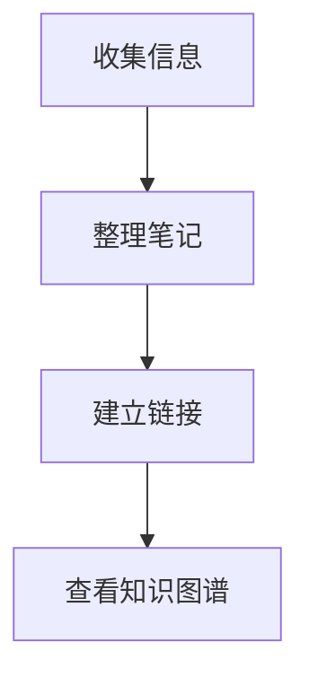

<p align="center">
  
</p>

<h1 align="center">Long编辑 · 知识助手</h1>

<p align="center">
  <strong>轻盈、专注、连接思考的本地 Markdown 知识库</strong>
</p>

<p align="center">
  
  
  
  
  
</p>

<p align="center">
  <a href="#下载安装">下载安装</a> ·
  <a href="#快速上手">快速上手</a> ·
  <a href="#建立知识连接">双向链接</a> ·
  <a href="#常用快捷键">快捷键</a>
</p>

Long编辑是一款本地优先的视觉知识与资料管理工作台。Markdown、JSON Canvas、PDF 和 CSV/TSV 始终保存在你选择的普通文件夹中，可以继续使用 Git、网盘或其他工具同步，不依赖私有数据库作为唯一事实源。

## 下载安装

当前稳定版本为 **v1.0.0**，支持 Windows 10/11 x64。

- [下载 v1.0.0](https://github.com/Longyuyeee/Long_MarkDownReader/releases/tag/v1.0.0)
- `.exe`：推荐个人用户使用，安装流程更简单。
- `.msi`：适合企业部署或需要 MSI 的安装场景。

覆盖安装新版本不会删除知识库、应用设置或历史副本。v1.0.0 是无 Authenticode 代码签名的社区版本，Windows 首次运行时可能显示“未知发布者”或 SmartScreen 提示；请只从本仓库的 GitHub Releases 下载，并按发布页 SHA-256 核对文件。

从 v1.0.0 开始，软件会每 24 小时自动检查一次更新，也可以在“设置 → 系统集成 → 软件更新”中手动检查。下载后的更新包必须通过内置 Tauri 更新公钥校验才会安装；该完整性签名与 Windows 发布者签名是两套独立机制。

## 快速上手

1. 启动软件，打开“设置”。
2. 添加一个现有文件夹作为知识库，也可以选择一个空文件夹开始使用。
3. 返回知识库，点击侧边栏顶部的“新建笔记”按钮。
4. 选择空白笔记或会议纪要、周报、读书笔记等模板。
5. 输入内容后按 `Ctrl + S` 保存；编辑时也会自动保存到磁盘。

知识库和磁盘目录保持一一对应。在软件内新建、重命名、移动或删除文件，会直接作用于本地文件系统。

## 编辑文档

### 编辑模式

编辑器支持三种模式，可以从编辑区工具栏切换：

| 模式 | 适合场景 |
| --- | --- |
| 所见即所得 | 日常写作，直接查看最终排版效果 |
| 即时渲染 | 保留 Markdown 标记，同时显示渲染结果 |
| 源码模式 | 专注编辑原始 Markdown 文本 |

编辑区还支持标题、列表、任务清单、表格、引用、代码块、数学公式、脚注、图片和 Mermaid 图表。

### 插入 Mermaid 图表

使用 `mermaid` 代码块即可创建流程图：



较宽的图表可以在编辑区域横向滚动查看。

### 图片与附件

- 粘贴或拖入图片时，软件会将图片保存到文档对应的资源目录。
- 打开外部 Markdown 文件时，相对路径图片仍可正常显示。
- 将外部文档导入知识库时，会尽量同步文档引用的本地图片。

### Mermaid 图表工作室

- 知识库可创建和打开普通 `.mmd` / `.mermaid` 文件，在源码与 SVG 实时预览之间同步编辑。
- 内置流程图、时序图、思维导图、类图、ER 图和甘特图模板；支持主题和预览缩放。
- 语法错误会显示摘要并尽量定位到源码行；保存使用外部修改检测和可靠写入。
- 常用流程图可打开“结构”面板编辑节点标签、形状和连线标签；修改精确回写源码，不覆盖注释、frontmatter 或高级语法。
- 有效预览可导出 SVG 或 1×/2×/3× PNG，支持透明、主题和白色背景；导出前会移除外部资源与可执行 SVG 内容。
- Canvas 可添加 Mermaid 源文件节点并实时预览；节点只保存相对路径，双击回到图表工作室编辑，跨画布复制会自动重定位引用。
- Mermaid 仅在进入图表工作室或出现可见 Canvas 图表节点时按需加载，并以严格安全模式渲染。

## 管理知识库

### 编辑 CSV/TSV 数据表

- 资料库可直接打开 `.csv` 和 `.tsv`，编辑表头与单元格，并增加行列或删除行。
- 支持类型提示、排序、全字段筛选、冻结首列和 5 万行级虚拟滚动。
- 保存时保留原分隔符、编码、BOM 与换行风格；如果文件已被其他程序修改，会先提示冲突而不是覆盖。
- 数据表可被统一搜索，也会作为独立节点进入知识图谱。
- 可把 CSV/TSV 转换为开放的 `.table.json`；数据与筛选、排序、冻结及列宽配置分离。
- 开放 Table 可导出 CSV 和基础 XLSX，导出文件不会覆盖已有文件。
- 同一 Open Table 可创建多个表格、看板和图表视图；专业图表编辑器支持柱状、折线、饼图、散点及分类/X、数值/Y、系列、聚合和空值策略，看板拖动与图表呈现始终作用于同一份行数据。
- Open Table 仪表盘可组合最多 24 个已有图表，共享全字段筛选，拖动调整顺序，并持久化 4/6/8/12 栅格卡片宽度；仪表盘只保存引用和布局，不复制源数据。
- Markdown 工具栏和 JSON Canvas 可嵌入实时 Table 图表引用；引用只保存源文件与视图 ID，可跳回源图表编辑，并在重新打开、聚焦或手动刷新时读取最新数据。
- `.xlsx` 可在独立工作簿工作面中只读打开，支持多 Sheet、公式文本/缓存结果切换和分页虚拟预览；选中 Sheet 可转换为开放 Table，原工作簿保持不变。
- 完整工作簿引擎审计已完成：默认版本不引入依赖商业许可/服务端的重型引擎；完整 XLSX 编辑仅在许可、部署和往返兼容验证通过后作为可选能力评估。

### 文件与标签页

- 左侧文件树用于浏览、新建、重命名、移动和删除笔记。
- 单击文件打开编辑，多个文件会以标签页形式保留。
- 右键文件可以收藏、重命名、删除或在资源管理器中打开目录。
- 切换标签页时，文件树会自动定位到对应文件。

### 搜索与标签

- 使用侧边栏搜索框查找当前知识库中的笔记。
- 按 `Ctrl + P` 打开命令面板，可以快速搜索文件或执行常用命令。
- 在正文中输入 `#标签名`，即可在标签面板按标签筛选笔记。

### 历史副本

软件会按设置的时间间隔保存影子副本。在侧边栏“备份”面板中可以预览、恢复或删除历史版本。影子副本不能替代正式备份，重要知识库仍建议配合 Git 或网盘使用。

## 建立知识连接

### 双向链接

在一篇笔记中输入双方括号即可链接另一篇笔记：

```text
[[会议记录]]
```

- 链接目标文件名在知识库中唯一时，可以直接写 `[[文件名]]`。
- 跨目录或存在同名文件时，建议写 `[[子目录/文件名]]`。
- 保存文档后，在侧边栏“引用”面板查看出站链接和反向链接。

### 知识图谱

打开知识图谱后，笔记显示为节点，双向链接显示为连线。可以拖动画布、缩放视图、拖动节点，双击节点可返回对应笔记。

如果图谱为空，点击页面中的“如何建立链接”，按照三步教程创建第一条连接。

## 外观与阅读体验

在“设置 → 外观主题”中可以：

- 从 16 套完整外观预设中快速选择风格。
- 独立组合界面风格与颜色主题。
- 调整动效节奏、代码高亮风格和文章背景色。
- 使用深色模式或跟随 Windows 系统主题。

外观预设只是快捷组合，应用预设后仍可以继续更换颜色，不会重置已经选择的界面风格。

## 导出、Git 与 AI

### 导出

编辑器支持导出 Markdown、HTML 和 PDF。PDF 会打开系统打印界面，在打印机选项中选择“另存为 PDF”即可。

### AI 凭据安全

API Key 保存在 Windows Credential Manager、macOS Keychain 或 Linux Secret Service 中，不写入应用配置、前端状态和日志。设置页不会回显已保存密钥；本机 Ollama 回环地址可以无 Key 使用。

### Git 同步

每个知识库都可以独立启用 Git：

1. 在设置的知识库条目中展开 Git 配置。
2. 填写远程仓库地址和分支名。
3. 返回知识库后初始化仓库，使用侧边栏的 Push/Pull 操作同步。

### AI 辅助

在设置中启用 AI 并填写服务商、接口地址、API Key 和模型名称。支持 OpenAI、DeepSeek、Ollama 以及兼容 OpenAI 格式的自定义接口。选中文字后按 `Alt + A`，可以进行润色、重写、总结或翻译。

## 常用快捷键

| 快捷键 | 功能 |
| --- | --- |
| `Ctrl + P` | 打开命令面板 |
| `Ctrl + S` | 保存当前文件 |
| `Ctrl + B` | 加粗 |
| `Ctrl + I` | 斜体 |
| `Ctrl + Z` / `Ctrl + Y` | 撤销 / 重做 |
| `Alt + A` | 对选中文本使用 AI 辅助 |
| `F2` | 重命名文件树中选中的项目 |
| `Delete` | 删除文件树中选中的项目 |
| `F11` | 切换专注模式 |

## 常见问题

### 为什么知识图谱没有连线？

请确认笔记中已经写入 `[[笔记名]]` 并保存。如果目标位于子目录或知识库中存在同名文件，请使用 `[[子目录/文件名]]`。

### 为什么修改了颜色却又恢复？

请升级到 v0.6.9。该版本已经修复外观预设覆盖颜色选择的问题。

### 我的笔记存在哪里？

笔记就是知识库目录中的普通 `.md` 文件。删除软件不会删除你选择的知识库目录，但卸载或迁移前仍建议自行备份。

### 如何打开知识库之外的 Markdown 文件？

可以在资源管理器中使用 Long编辑打开 `.md` 文件，软件会进入临时编辑模式；也可以在设置中将 Long编辑设为默认 Markdown 编辑器。

## 开发与质量检查

安装 Node.js、Rust 和 Tauri 所需的 Windows 构建环境后，执行：

```powershell
npm ci
npm run ci:check
```

`ci:check` 是本地与 GitHub Actions 共用的质量门禁，会依次完成 TypeScript 类型检查、前端生产构建、锁定依赖下的 Rust 测试以及生产依赖安全审计。

## 技术架构

- 桌面运行时：Rust + Tauri 2
- 前端：Vue 3 + TypeScript + Pinia
- UI：Naive UI
- 编辑器：Vditor
- 知识图谱：Canvas 力导向布局

## 作者

**longyuye** — Project Architect & Lead Developer
