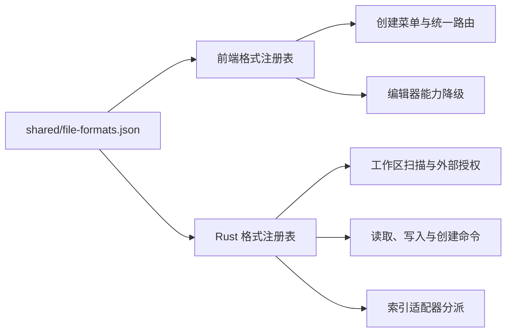

# 文件格式扩展契约

## 1. 目标

文件格式能力由 `shared/file-formats.json` 统一声明，前端与 Rust 后端消费同一份事实源。新增同类文本格式时，不应继续修改 Library 根页面的扩展名判断、Rust 文件扫描白名单或索引入口。

本阶段用纯文本 `.txt` 适配器证明扩展链路可用；它是平台能力样例，不代表 F7-2 的专业格式编辑器已经完成。

## 2. 契约字段

每种格式必须声明：

- `id`、显示名称、扩展名和 MIME 类型；
- `routeName` 与单文件最大字节数；
- `read`、`edit`、`create`、`index` 四项能力，取值为 `supported`、`planned` 或 `unsupported`；
- 外部文件策略：允许编辑、仅允许导入或拒绝；
- reader、writer、creator、indexer 适配器；
- 可创建格式的默认文件名、模板和创建菜单信息。

能力声明必须真实：没有实现适配器时不得标记为 `supported`。结构门禁会拒绝能力与适配器不一致、重复扩展名以及重新引入根级扩展名白名单。

## 3. 运行链路

前端根据契约决定菜单、路由和工作面能力；后端再次校验格式、路径、大小和授权，不能信任前端传入的格式 ID。复合扩展名按最长匹配处理，例如 `.table.json` 优先于 `.json`。

## 4. 能力降级

- `read=supported`、`edit=unsupported`：只读打开，不显示保存入口。
- `edit=planned`：不得进入可写编辑器，可展示明确的规划提示。
- `index=unsupported`：跳过索引，不伪造搜索能力。
- reader 或 writer 不可用：后端返回明确错误，禁止静默转为其他格式。
- 外部策略为 `import`：只能复制到知识库后处理；为 `none` 时直接拒绝。

## 5. 新增格式检查清单

1. 在共享 JSON 中增加格式和真实能力声明。
2. 优先复用已注册的 reader、writer、creator 和 indexer；只有新交互模型才增加独立适配器。
3. 为新磁盘格式提供真实 fixture、读取失败路径和往返测试。
4. 验证工作区扫描、创建、打开、外部授权、索引和搜索结果路由。
5. 运行 `npm run check:format-contract`、`npm run ci:check`、严格 Clippy 和 Tauri Debug 构建。
6. 更新 PRD 的兼容边界；“能打开”不等于“可往返专业编辑”。

## 6. F7-2 候选评分

评分采用 1—5 分，维度为用户价值、开放性、往返保真、索引价值和维护可控性；总分越高越适合作为第一种新增专业格式。

| 候选 | 用户价值 | 开放性 | 往返保真 | 索引价值 | 维护可控 | 总分 |
|---|---:|---:|---:|---:|---:|---:|
| OPML 大纲/思维导图 | 5 | 5 | 5 | 5 | 4 | 24 |
| SVG 矢量图 | 4 | 5 | 4 | 3 | 3 | 19 |
| Draw.io XML | 4 | 4 | 4 | 3 | 3 | 18 |
| DOCX | 5 | 4 | 2 | 4 | 1 | 16 |
| PPTX | 4 | 4 | 2 | 3 | 1 | 14 |

F7-2 已按评分结论交付 OPML：它直接增强当前较弱的思维导图体验，磁盘格式开放、树结构明确、可全文索引，并可投影为 JSON Canvas。首批已包含树形/思维导图双视图、拖拽层级、折叠、搜索、OPML 往返和 Canvas 投影；完整边界见 `OPML_Mind_Map_Editor_Design.md`。

## 7. 当前边界

- `.txt` 复用文本工作面，Markdown 专属的双链、图表嵌入和思维导图视图会被关闭。
- XLSX、PDF、Canvas、Table 和 Mermaid 仍使用各自专业适配器；统一契约不消除其领域逻辑。
- 工作簿索引仍是 `planned`，不得宣称已具备完整跨格式索引。
- 真正的 Office 等价编辑需要按兼容矩阵逐项交付，不能由格式注册表本身保证。
