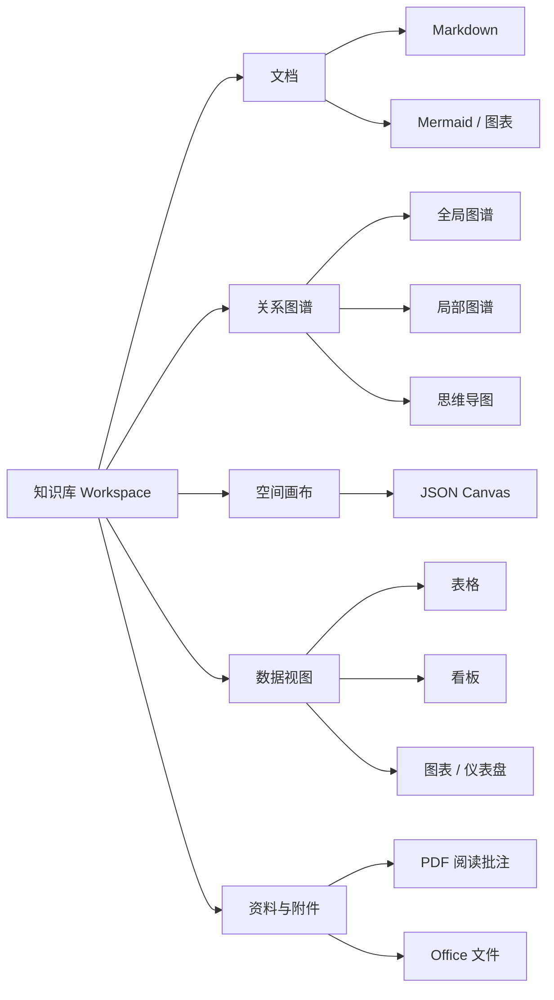
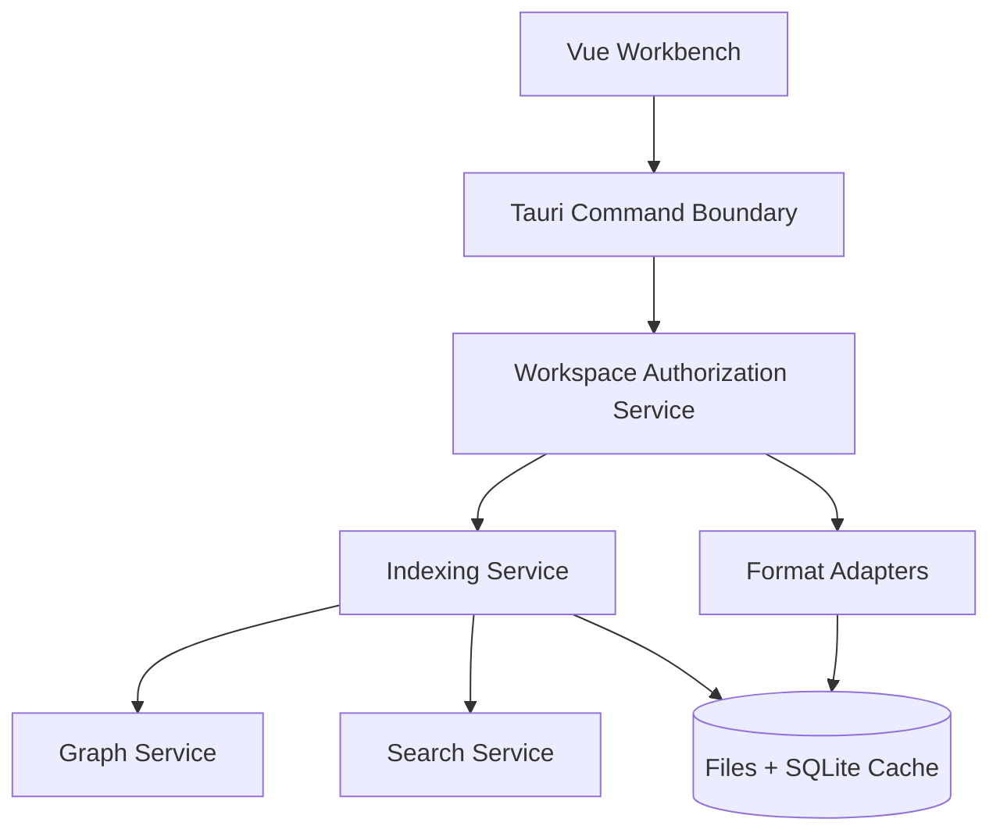

# LongEdit 专业知识工作台综合设计文档

> 文档版本：1.0  
> 审计日期：2026-07-18  
> 适用基线：LongEdit v0.6.9  
> 状态：产品与技术方案，可进入里程碑评审

> 主需求、优先级、验收标准与开发顺序见：[Product_Requirements_and_Development_Roadmap.md](./Product_Requirements_and_Development_Roadmap.md)

## 1. 执行摘要

LongEdit 当前已经具备优秀的本地 Markdown 编辑、知识库、标签、双向链接、历史版本、Git 和 AI 基础，但产品仍属于“带知识管理功能的 Markdown 编辑器”，尚未形成专业知识工作台。

核心瓶颈不是功能数量，而是对象之间缺乏统一关系：图谱只是结果展示，文件只是目录项，标签只是筛选条件，PDF/表格等格式无法进入同一个知识网络。继续横向堆叠编辑器会增加复杂度，却不会形成产品壁垒。

建议把产品升级目标定义为：

> **以本地文件为可信数据源，以知识图谱为导航中枢，以空间画布为思考界面，以结构化数据视图为管理能力的本地优先专业知识工作台。**

产品应形成四个互补工作面：

1. **文档工作面**：Markdown、富文本、代码、公式和 Mermaid。
2. **关系工作面**：全局图谱、局部图谱、思维导图、路径分析。
3. **空间工作面**：无限画布，组合笔记、文件、网页、图片和分组。
4. **数据工作面**：表格、数据库视图、图表和仪表盘。

本轮已经落地知识图谱第一阶段和关键安全快修，后续应以本文路线图继续建设。

## 2. 当前产品审计

### 2.1 技术基线

| 层级 | 当前实现 | 评价 |
|---|---|---|
| 桌面容器 | Tauri 2 / Rust | 体积和本地能力优秀，适合本地优先路线 |
| 前端 | Vue 3 / TypeScript / Pinia | 技术现代，但核心页面职责过重 |
| Markdown | Vditor | 已覆盖所见即所得、即时渲染、源码模式、Mermaid、KaTeX |
| 图谱 | 自研 Canvas 2D 力导向布局 | 性能可控，但产品能力此前仅停留在展示层 |
| 存储 | Markdown 文件 + JSON 配置 + 本地历史目录 | 透明、可迁移，但缺少统一元数据索引 |
| 同步 | Git | 适合技术用户，冲突与大附件体验仍需治理 |
| AI | OpenAI 兼容接口 | 可扩展，但密钥存储与知识检索能力不足 |

### 2.2 当前优势

- 本地文件是真实数据源，不把用户锁入私有云数据库。
- Markdown 编辑体验、主题系统和 Windows 集成完成度较高。
- 双向链接、标签、图谱、历史、Git、AI 已形成知识工具的基本骨架。
- Tauri 后端适合承担索引、格式转换、文件监控和安全边界。

### 2.3 当前主要问题

#### 产品层

- 图谱入口独立且被动，不能自然参与日常编辑。
- 全局图谱信息密度高，但缺少局部问题导向的视图。
- 图谱不能创建和编辑关系，用户无法通过视觉方式组织知识。
- 文件树、标签、图谱和搜索没有共享同一套筛选与对象模型。
- 只把 Markdown 视为一等对象，其他格式无法建立统一引用、批注和关系。

#### 工程层

- `LibraryMode.vue`、`SettingsView.vue` 和 Rust `lib.rs` 已成为巨型模块。
- 缺少自动化测试，文件删除、重命名、双链解析和格式迁移风险较高。
- 文件命令缺少统一的授权路径服务。
- AI 密钥仍以明文配置保存。
- 主包体仍超过 1.4 MB，需要进一步拆包。

## 3. 本轮已经实施的改进

### 3.1 知识图谱 1.0 增强

- 新增“关系网络 / 思维导图”双模式。
- 任意节点可设为思维导图中心。
- 支持 1–4 层关系深度展开。
- 支持节点标题和路径搜索。
- 支持显示/隐藏孤立笔记。
- 新增节点详情、入链、出链、总关系数和相关笔记导航。
- 后端过滤无效目标边并去除重复关系。
- 节点权重改为按关系密度计算，而非按文件字节数计算。

### 3.2 安全与依赖

- Vditor 运行资源改为安装包本地资源，不再依赖运行时 CDN。
- 恢复 Tauri CSP。
- 修复 Markdown 删除时通过 `../` 越界删除关联图片的风险。
- 自定义图片协议拒绝非图片格式、SVG 和超过 50 MB 的文件。
- 清除本地权限配置中的明文 GitHub Token 命令。
- npm 依赖漏洞由 7 个降低为 0。
- 新增统一 ReliableWrite 服务；Markdown、Canvas、配置、历史和导出写入具备同目录临时文件、恢复备份与中断恢复机制。
- API Key 已迁入操作系统凭据库；配置文件和前端状态只保留非敏感 AI 设置及凭据存在状态，旧明文配置一次性迁移后清除。
- 同进程写入串行化，避免自动保存和手动保存并发造成内容交叉。

仍需人工在 GitHub 撤销曾暴露的令牌；从文件中删除令牌不能使已签发凭据失效。

### 3.3 Phase 1 局部图谱（已实施）

- “引用”侧栏新增当前笔记局部关系图，图谱进入日常编辑工作流。
- 支持 1–3 跳关系深度切换、方向边、节点点击导航和孤立笔记提示。
- 支持一键以当前笔记为中心打开全屏思维导图。
- Rust 新增局部子图过滤命令，避免向前端返回无关节点。
- 新增局部图谱深度、未知中心节点和父目录穿越三项单元测试。
- 已通过 Vite 生产构建、Rust 测试和 Tauri Debug 桌面编译。
- 局部图谱和全局节点详情已增加“关系依据”，展示链入/链出方向、原始 Wikilink 语法、所在行、上下文和重复引用次数。
- 新增 `formats/markdown.rs` 统一解析器，忽略代码围栏和行内代码，并以 Unicode 安全方式截取上下文。
- 支持 `relations` frontmatter 中的 `parent`、`child`、`depends-on`、`related`、`contains`、`cites`、`annotates`、`derived-from` 等轻量类型；`related` 以无方向虚线呈现。
- 局部图谱深度偏好会保存在设备端，切换笔记后保持用户选择。
- 全局图谱和局部图谱现已共享搜索、标签、目录、修改日期、对象类型、关系类型和孤立笔记筛选模型，筛选偏好在设备端同步持久化。
- 图谱节点数据增加标签、知识库相对目录、最后修改时间和对象类型，为后续跨格式节点与知识库健康度提供稳定元数据接口。

知识治理现已形成可操作闭环：知识库扫描会分类展示断链、歧义链接和孤立笔记，给出来源上下文与候选目标；用户可逐条确认，或批量应用高置信度建议。修复过程会保留链接别名，并重新校验知识库边界、目标文件、原始语法和行号，避免陈旧建议或越界路径造成误写。

下一迭代应继续实现 Canvas 对齐吸附、参考线和键盘微调，并补充局部图谱布局持久化；关系类型后续还需提供可视化编辑入口和跨格式适配。

### 3.4 Phase 2 开放 Canvas MVP（已实施）

- 知识库文件树开始识别、创建、重命名、搜索和打开 `.canvas` 文件。
- 后端增加受知识库根目录约束的 Canvas 专用读写命令、20 MB 上限、结构校验与原子保存。
- 采用 JSON Canvas `nodes/edges` 数据结构，不引入私有数据库或不可迁移字段。
- 画布支持文本、文件、链接、分组四类节点，以及拖拽、缩放、平移、调整尺寸、着色、连线和删除。
- 支持自动保存、手动保存、适应内容、快捷键和从文件节点返回 Markdown 原文。
- 当前笔记局部图谱和全局图谱节点均可一键生成可编辑 Canvas；自动关系负责发现，Canvas 负责人工整理。
- 新增 Canvas 有效文档、悬空边拒绝及图谱转换互操作测试。
- Markdown 编辑器新增“转脑图”，将标题和有序/无序列表解析为可编辑层级 Canvas，并保留源文档文件节点。
- 转换过程忽略代码围栏内容，保留标题与缩进列表的父子关系，单次最多生成 500 个结构节点。
- Canvas 新增 60 步撤销/重做、Ctrl/Shift 多选、Shift 框选、批量拖拽、全选、左/顶对齐与横向/纵向分布。
- 撤销历史仅保存在当前编辑会话，不写入 `.canvas` 文件，确保 JSON Canvas 互操作格式不被私有状态污染。
- Canvas 新增节点边缘与中心吸附、动态参考线和多选整体吸附；阈值随缩放比例换算，Alt 可在拖拽期间临时绕过吸附。
- 工具栏吸附偏好仅保存在设备状态；方向键支持 1 px 微调，Shift+方向键支持 10 px 快速微调，并完整接入撤销和自动保存。
- Canvas 连线属性面板现已覆盖标签、起止端口、正向/反向/双向/无方向箭头、预设或自定义颜色以及关系类型；除关系类型外均直接采用 JSON Canvas 1.0 标准字段。
- `relationType` 是可选、可忽略的互操作扩展，图谱转 Canvas 时会保留原关系语义；后端保存前校验标准边字段，未知字段仍保持往返。
- 思维导图节点支持方向感知的分支折叠，隐藏节点、相关连线和数量状态同步更新；折叠偏好仅保存在设备端，不改变开放文件。
- 自动布局固定选中根节点，只整理其可见子树并保持画布其他区域不动；被移动节点的原始手工坐标会保存为跨重开的设备端恢复点，可一键恢复且全程支持撤销。
- Canvas 支持节点与内部关系的复制、剪切和粘贴，片段保留全部开放格式与未知字段，粘贴时重新映射 ID 并拒绝悬空外部边。
- 跨画布粘贴使用知识库相对来源重定位文件节点，不暴露绝对路径；系统剪贴板不可用时降级到会话剪贴板，外部 JSON 片段在进入画布前执行数量、大小和结构校验。
- Canvas 大画布采用节点/邻接索引、视口外 DOM 裁剪、连线包围盒裁剪和几何签名缓存；拖拽只更新移动节点及关联连线，避免千节点场景的全量重算。
- 超过 180 个可见节点后启用 260 屏幕像素 overscan，并实时显示实际渲染量和采样 FPS；1,000 节点格式回归测试防止数据层复杂度退化。

视觉知识闭环的 Canvas 核心能力已补齐；下一迭代转向知识图谱布局持久化和 PNG/SVG 输出，形成可重复整理与交付能力。

## 4. 同类产品研究

### 4.1 竞品能力比较

| 产品 | 核心方法 | 值得借鉴 | 不宜直接照搬 |
|---|---|---|---|
| Obsidian | 本地 Markdown + 插件 + Graph/Canvas | 全局/局部图谱、深度、筛选、分组、开放 Canvas 格式 | 图谱常被用户视为“漂亮但低频”，需要工作流化 |
| Logseq | 块级大纲 + 引用 + Whiteboard | 块级引用、PDF 高亮、查询、白板与图谱联动 | 块模型迁移成本高，不适合直接替换现有 Markdown 文件模型 |
| Heptabase | 卡片 + 白板 + 标签数据库 | 以白板进行复杂主题理解、嵌套白板、卡片数据库 | 完全白板中心会削弱文件透明性 |
| AFFiNE | 文档 + Edgeless + Database | 同一内容在页面与无边画布间切换 | 全量协作和 Office 化会显著提高工程复杂度 |
| Anytype | 对象图谱 + 类型/关系 + Collection | 对象类型、关系属性、查询集合、本地优先 | 私有对象模型容易造成数据锁定 |
| 思源笔记 | 块引用 + 数据库 + PDF + 图表 | 功能完整、PDF 标注链接、数据库和多种图表 | 功能密度过高，LongEdit 应保持渐进式界面 |
| Notion | Page + Database + 多视图 | 同一数据源的表格、看板、日历、时间线、图表和仪表盘 | 云端和数据库中心路线不符合本地文件定位 |

### 4.2 可验证的行业模式

- Obsidian 图谱提供搜索、标签、附件、孤立节点、方向箭头、分组、力参数和局部图谱深度，说明“筛选 + 局部化”比单纯增加节点动画更有用：[Obsidian Graph View](https://obsidian.md/help/Plugins/Graph%2Bview)。
- Obsidian Canvas 使用开放的 `.canvas` 文件；[JSON Canvas 1.0](https://jsoncanvas.org/spec/1.0/) 定义 text、file、link、group 节点和边，适合作为 LongEdit 画布互操作格式。
- Logseq 将知识图谱、白板、PDF 高亮、查询和块引用放进同一产品体系：[Logseq Docs](https://docs.logseq.com/)。
- Heptabase 的核心工作流是用白板理解复杂主题，并用嵌套白板与标签属性组织卡片：[Heptabase Public Wiki](https://wiki.heptabase.com/)。
- Anytype 图谱支持方向、标题、图标、属性链接和未连接对象，并以 Collection/Query 组织对象：[Anytype Graph](https://doc.anytype.io/anytype-docs/advanced/feature-list-by-platform/graph)、[Anytype Collections](https://doc.anytype.io/anytype-docs/getting-started/sets/collections)。
- 思源把块级双链、数据库、PDF 标注链接、图表和导出组合为一体：[SiYuan](https://github.com/siyuan-note/siyuan)。
- Notion 的多视图包含 table、board、calendar、timeline、gallery、chart、map 和 dashboard，关键不是支持格式，而是让同一数据拥有多种视图：[Notion Views](https://developers.notion.com/guides/data-apis/working-with-views)、[Notion Charts](https://www.notion.com/en-gb/help/charts)。

### 4.3 结论

行业优秀产品都在从“文件编辑器”走向“对象 + 关系 + 多视图”，但 LongEdit 不应放弃本地文件优势。正确路线是：

- 文件仍是可见、可迁移的数据源。
- SQLite/FST 索引仅作为可重建缓存，不成为唯一真相。
- 图谱负责发现关系，Canvas 负责主动组织关系。
- 表格/数据库负责结构化管理，PDF 负责阅读与批注。

## 5. 产品信息架构



建议主导航调整为：

1. **主页**：最近文档、收藏、待办、知识库健康度。
2. **资料库**：文件树和多标签编辑器。
3. **关系**：全局图谱、局部图谱、思维导图。
4. **画布**：用户创建的视觉工作区。
5. **数据**：表格、集合、看板、图表。
6. **收件箱**：快速笔记、导入文件、网页剪藏待整理项。

图谱不应只存在于独立页面。编辑器右栏应常驻“局部关系”小组件，显示当前笔记的入链、出链、同标签笔记和二跳关系。

## 6. 知识图谱专业化设计

### 6.1 图谱的三个使用层次

#### A. 全局图谱：发现结构

用于识别主题簇、孤立知识、枢纽笔记和长期演化，不作为主要导航方式。

能力要求：

- 按路径、标签、类型、日期、关系数过滤。
- 节点颜色分组和图例。
- 孤立节点、断链、未引用附件开关。
- 节点大小规则：入链数、总关系、字数、最近活跃度。
- 聚类：Louvain/Leiden 社区发现，结果作为建议，不写回用户数据。
- 时间回放：按创建/修改时间观察知识库生长。

#### B. 局部图谱：解决问题

以当前文档为中心展示 N 跳关系，是最高频、最有实用价值的图谱。

能力要求：

- 1–4 跳深度。
- 区分入链、出链、标签、引用附件、父子目录。
- 边具有方向、类型和上下文片段。
- 悬停边时展示“为什么连接”。
- 可固定到编辑器右栏，并随活动标签页切换。

#### C. 思维导图：表达层级

自动思维导图不等于知识图谱。它需要一个明确根节点和树状父子关系。

生成来源按优先级划分：

1. Markdown 标题层级生成文档思维导图。
2. 列表缩进生成大纲思维导图。
3. 以指定笔记为中心，对双链关系执行 BFS 生成关系思维导图。
4. 用户在 Canvas 中手动调整并保存为持久化思维导图。

### 6.2 关系类型

当前所有边都只是 wikilink，表达能力不足。建议引入轻量关系语法：

```markdown
---
type: project
status: active
relations:
  parent: [[知识管理系统]]
  depends-on: [[索引服务]]
  related: [[图谱交互设计]]
---
```

关系类型至少包括：

| 类型 | 含义 | 是否有方向 |
|---|---|---|
| links-to | 普通双链引用 | 是 |
| parent / child | 层级关系 | 是 |
| depends-on | 依赖 | 是 |
| related | 相关 | 否 |
| contains | Canvas/Collection 包含 | 是 |
| cites | 文献引用 | 是 |
| annotates | 批注指向 PDF/附件 | 是 |
| derived-from | 派生内容 | 是 |

### 6.3 图谱交互闭环


只有形成该闭环，图谱才是工作工具，而不是展示页面。

### 6.4 图谱健康指标

主页可提供非强制性的“知识库健康度”：

- 孤立笔记数量。
- 断链数量。
- 无标题/空文档数量。
- 30 天未整理的收件箱项目。
- 高入链枢纽笔记。
- 重复标题和潜在重复内容。

不得用单一分数制造焦虑；应提供可执行列表和“一键进入整理模式”。

## 7. 无限画布与思维导图编辑器

### 7.1 为什么必须独立于自动图谱

自动图谱忠实反映已有链接；画布表达用户当下的主观结构。两者数据来源、布局稳定性和编辑权限完全不同，强行合并会导致图谱位置漂移或用户修改被重算覆盖。

建议新增 `.canvas` 一等文件类型，采用 [JSON Canvas](https://jsoncanvas.org/) 作为磁盘格式：

- text 节点：轻量 Markdown 卡片。
- file 节点：引用库内 Markdown、PDF、图片、表格。
- link 节点：网页资源。
- group 节点：主题、阶段、泳道。
- edge：支持标签、颜色、箭头和端点。

### 7.2 编辑能力

- 无限缩放和平移、框选、多选、对齐、分布、吸附。
- 快捷创建卡片和连接线。
- 将选中节点自动整理为思维导图、流程图、鱼骨图或时间线。
- 从 Markdown 标题/列表导入为思维导图。
- 将画布分支导出为 Markdown 大纲。
- 节点可打开原文件，文件内容不复制进 Canvas。
- 支持嵌套画布与演示模式。

### 7.3 推荐实现

第一阶段使用 Vue + SVG/Canvas 自研轻量节点层，数据遵循 JSON Canvas；不要立即引入大型白板套件。需要自由手绘时，再评估 Excalidraw/tldraw 的嵌入成本和许可证。

## 8. 多格式支持可行性审计

### 8.1 决策原则

格式支持分四级：

1. **索引**：可进入搜索和图谱。
2. **预览**：可在应用内阅读。
3. **批注**：可高亮、评论并反链到笔记。
4. **原生编辑**：可完整修改并兼容外部软件。

不是所有格式都应追求第四级。完整 PDF/Word/Excel 兼容是独立 Office 产品量级。

### 8.2 格式能力矩阵

| 格式 | 索引 | 预览 | 批注 | 编辑 | 推荐策略 |
|---|---:|---:|---:|---:|---|
| Markdown | P0 | P0 | P1 | P0 | 继续作为核心原生格式 |
| Mermaid | P0 | P0 | — | P1 | 增加双栏代码/图形编辑和模板库 |
| Mindmap | P0 | P0 | — | P0 | Markdown 大纲 + JSON Canvas 双表示 |
| JSON Canvas | P0 | P0 | — | P1 | 作为无限画布开放格式 |
| CSV/TSV | P0 | P0 | — | P1 | 轻量表格原生编辑 |
| XLSX | P1 | P1 | — | P2 | 原生只读预览并转 Table；完整编辑仅作为经许可的可选引擎 |
| PDF | P1 | P1 | P1 | 不建议 | PDF.js 阅读层 + 独立批注 sidecar |
| DOCX | P2 | P2 | P2 | P3/插件 | 预览/转换优先，完整编辑交给 Office 引擎 |
| PPTX | P2 | P2 | P2 | P3/插件 | 预览和引用优先 |
| 图片 | P0 | P0 | P1 | P2 | 元数据、OCR、标注，不做 Photoshop |
| 音视频 | P2 | P1 | P2 | 否 | 播放、时间戳笔记、转录 |
| 网页 | P1 | P1 | P1 | 否 | 快照、正文提取、来源引用 |

### 8.3 表格与 Excel

S3-7 已完成 [Univer](https://docs.univer.ai/) 等完整工作簿引擎审计。Univer 开源核心可提供表格渲染、公式、格式和插件架构，但本项目需要的完整 XLSX 导入导出、图表、数据透视和协作位于 Pro 边界，导入导出还依赖服务端能力。最小 Sheets Core preset 实测也会显著增加前端包体和 React/Radix 运行时。因此默认构建不引入完整引擎，详细决策见 `Workbook_Engine_Evaluation.md`。

推荐分期：

- P1：自有 `.table.json` 或 CSV 编辑器，支持类型、排序、筛选、公式子集。
- P2：继续增强开放 Table、仪表盘和共享筛选，保持本地文件事实源。
- P2.5：商业需求、许可和部署模型获批后，以独立路由验证可选 Univer Pro 引擎。
- P3：数据表生成图表和仪表盘，并允许嵌入 Markdown/Canvas。

不要直接把 Markdown 表格升级成 Excel；文档表格和数据工作簿应是两种对象。

当前落地状态（S6-7）：CSV/TSV 已提供原生二维编辑、类型推断、排序、筛选、冻结首列和虚拟滚动，并以原文件作为唯一事实源。Open Table 1.0 使用 `.table.json`，以稳定行列 ID 保存 `data`，以独立 `views` 保存表格、看板、图表和仪表盘配置；规范见 `Open_Table_Format_Spec.md`。仪表盘可组合最多 24 个既有图表，共享筛选后的行索引，并持久化卡片顺序与 12 栅格宽度；专业图表及 Markdown/Canvas 实时引用仍直接消费同一数据源。XLSX 已进入原生渐进编辑：支持受签名保护的单元格/区域内容与基础样式写回、多区域与填充柄、公式引用迁移，以及内存中的同 Sheet/跨 Sheet 按需重算；未编辑 OOXML 部件继续保留。完整 Excel 等价仍是长期目标，必须按 `XLSX_Compatibility_Boundary.md` 和真实 fixture 逐项验收，当前不能宣传为完整等价。

### 8.4 PDF

[PDF.js](https://mozilla.github.io/pdf.js/getting_started/) 适合解析、渲染和构建阅读器。PDF 原文内容是页面绘制指令，不等价于可编辑文档结构，因此 LongEdit 不应承诺 Acrobat 级原文编辑。

推荐能力：

- 应用内阅读、目录、缩略图、搜索和页面跳转。
- 文本高亮、区域框选、评论和手写批注。
- 批注保存为独立 `filename.pdf.annotations.json`，避免破坏原 PDF。
- 每条批注获得稳定 URI：`longedit://pdf/<asset-id>?page=12&annotation=<id>`。
- Markdown 可引用批注，图谱建立 `annotates` 边。
- 后续再评估把标准注释写回 PDF 的兼容性。

### 8.5 图表与流程图

Vditor 已包含 Markdown 内 Mermaid 运行能力，[Mermaid Mindmap](https://mermaid.ai/open-source/syntax/mindmap.html) 也支持基于缩进的层级图。S4-1 已新增独立 `.mmd` / `.mermaid` 图表工作室，使用精确锁定的 Mermaid 11.16.0，在独立路由中提供源码、实时 SVG、错误行定位、模板、主题、缩放和可靠保存。S4-2 已为常用流程图增加节点/连线结构表单，采用精确源码区间替换保留 frontmatter、注释与高级语法；完整边界见 `Mermaid_Diagram_Workspace.md`。

S4-3 已完成安全 SVG/PNG 导出。S4-4 使用标准 JSON Canvas 文件节点嵌入 Mermaid 实时预览，Canvas 只保存源文件相对路径，双击回到图表工作室编辑，因此组合画布不会产生第二份图表源码或静态截图锁定。

图表工作室分期：

- 左侧源码、右侧实时预览（已完成）。
- 流程图、时序图、类图、ER、甘特图和思维导图模板（已完成）。
- 常用流程图节点/连线表单编辑与源码双向同步（已完成）；其他 Mermaid 图类型保持源码优先。
- SVG/PNG 导出（已完成）：支持矢量文字、1×/2×/3× PNG、三种背景和安全资源清理。
- 从 AI 生成后必须进入可编辑源码，不保存为不可修改图片。

## 9. 统一对象与索引架构

### 9.1 对象模型

```ts
interface KnowledgeObject {
  id: string              // 基于库内相对路径或持久 UUID
  type: 'markdown' | 'canvas' | 'table' | 'pdf' | 'image' | 'web' | 'audio' | 'video'
  path: string
  title: string
  tags: string[]
  properties: Record<string, unknown>
  createdAt?: number
  modifiedAt: number
  contentHash: string
}

interface KnowledgeRelation {
  id: string
  sourceId: string
  targetId: string
  type: string
  directed: boolean
  sourceLocation?: { line?: number; page?: number; annotationId?: string }
  context?: string
}
```

### 9.2 存储原则

- Markdown、Canvas、CSV/PDF 等用户文件为事实源。
- Frontmatter 保存用户可理解的属性和显式关系。
- `.longedit/index.db` 保存可重建索引、全文搜索、图谱边和缓存。
- `.longedit/state/` 保存布局、最近打开状态等设备状态。
- `.longedit/history/` 或应用数据目录保存版本历史。
- Git 默认忽略可重建索引和设备状态。

### 9.3 服务划分



Rust `lib.rs` 应拆分为：

- `commands/files.rs`
- `commands/graph.rs`
- `commands/search.rs`
- `commands/git.rs`
- `commands/ai.rs`
- `services/workspace_guard.rs`
- `services/indexer.rs`
- `formats/markdown.rs`
- `formats/pdf.rs`
- `formats/canvas.rs`
- `formats/table.rs`

当前实施进度：Canvas、Diagram、PDF、Table、Workbook、Graph、Index、Config、AI、Git、History、Search、Files 和 System 命令均已有独立模块，格式适配器与 WorkspaceGuard、可靠写入、凭据、数据迁移等服务也已分层。全局/局部图谱构建、反向链接、知识库统计及 Markdown/PDF/表格节点适配器均已归入 Graph 模块，平台关联与 URL 标题等系统命令已归入 System 模块。按项目既有代码行统计口径，`lib.rs` 已从 2,257 行降至 314 行，仅保留 Tauri 应用装配、托盘/窗口事件、URI 协议和命令注册等入口职责；FR-BASE-004 模块化验收完成。

## 10. 安全设计

### 10.1 必须完成

- 所有文件命令通过 `WorkspaceGuard`，不直接接受未经授权的任意路径。
- 临时模式打开外部文件时签发短期 capability，而不是放开整个文件系统。
- 自定义 URI 使用 opaque asset ID，不直接暴露绝对路径。
- API Key 使用 Windows Credential Manager/macOS Keychain/Linux Secret Service。
- CSP 默认拒绝远程脚本；插件和外部内容运行在隔离 Webview。
- HTML 导出前执行明确的消毒策略。
- Git 操作限制在已登记知识库，禁止将路径解释为命令参数。

### 10.2 插件模型

专业系统最终需要插件，但必须是能力声明模型：

```json
{
  "id": "com.example.pdf-tools",
  "permissions": ["workspace:read", "annotation:write"],
  "fileTypes": ["pdf"],
  "network": []
}
```

默认不给网络、Shell、知识库全写权限。

## 11. 性能与质量目标

| 指标 | 目标 |
|---|---:|
| 10,000 Markdown 文件首次索引 | < 30 秒 |
| 增量更新单文件 | < 300 ms |
| 全文搜索首屏 | < 150 ms |
| 2,000 节点全局图谱可交互 | ≥ 45 FPS |
| 500 节点局部图谱 | ≥ 55 FPS |
| 100 MB PDF 首屏 | < 2 秒（渐进加载） |
| 50,000 行 CSV 首屏 | < 2 秒（虚拟滚动） |
| 崩溃导致用户内容丢失 | 0 |

测试体系：

- Rust 单元测试：路径验证、双链解析、断链、重名、符号链接、批量删除。
- Fixture 测试：Markdown、Canvas、CSV、PDF 元数据和编码。
- Vue 组件测试：图谱筛选、思维导图深度、节点选择。
- Playwright/Tauri E2E：打开库、编辑保存、恢复历史、导出、Git 状态。
- 性能基准：1k/10k/50k 文件索引和 500/2k/10k 节点图谱。

当前质量门禁：本地和 GitHub Actions 统一执行 `npm run ci:check`，覆盖类型检查、前端生产构建、21 项 Rust 测试和生产依赖审计；真实 Tauri 进程级 E2E 与性能基准仍按后续 Phase 0 任务推进。

## 12. 分期路线图

### Phase 0：安全与工程基线（2–3 周）

- 完成 WorkspaceGuard 和外部文件 capability。
- Keychain 密钥存储。
- 拆分 Rust 命令模块。
- 建立测试与 CI 门禁。
- 完成包体拆分。

验收：无已知高危依赖；路径安全测试全通过；关键保存流程有 E2E。

### Phase 1：图谱成为日常工具（3–5 周）

- 当前双模式图谱继续完善。
- 编辑器右栏局部图谱。
- 关系方向、类型和上下文。
- 标签/目录/日期筛选与颜色分组。
- 断链和孤立笔记整理工作流。
- 图谱布局持久化和 PNG/SVG 导出。

当前实施状态：关系网络坐标已按知识库保存在设备端；思维导图布局按知识库、中心节点和展开深度隔离保存。SVG/PNG 导出基于当前筛选后的完整数据边界生成，与屏幕缩放和可见区域解耦；用户通过系统保存对话框选择输出位置。

验收：图谱周活跃用户占知识库用户 ≥ 35%；从图谱打开笔记成功率 ≥ 99%。

### Phase 2：开放画布与真正思维导图（5–8 周）

- JSON Canvas 读写。
- 卡片、文件、链接、分组、连接线。
- Markdown 标题/列表转思维导图。
- 图谱局部子图发送到 Canvas。
- Canvas 节点打开原文档和反向定位。

验收：`.canvas` 可与支持 JSON Canvas 的工具互换；千节点画布保持可用。

### Phase 3：PDF 阅读研究工作流（4–6 周）

- PDF.js 阅读器。
- 当前实现：PDF 已成为知识库文件树中的可打开对象；阅读器使用本地打包的 PDF.js 主线程与 Worker，提供连续滚动、懒渲染页面/缩略图、书签目录、缩放、页跳转和设备端阅读位置恢复。读取命令受知识库边界和 64 MB 上限约束，原 PDF 全程只读。
- PDF 文本层与搜索已落地：可见页使用与 Canvas 同 viewport 的透明文本层提供原生选择复制；全文搜索按页渐进提取并缓存文本，支持跨文本片段命中、计数、循环导航和高亮，切换文档后不保留正文索引。
- PDF sidecar 批注已落地：文字高亮、矩形区域和页评论统一写入版本化 `filename.pdf.annotations.json`；页面使用归一化坐标，侧栏支持定位、编辑、换色和删除，可靠写入不修改原 PDF，源指纹变化时降级为只读警告。
- PDF 批注引用到 Markdown 已落地：后端从真实 sidecar 生成包含摘录与 `longedit://pdf` 来源链接的引用块，使用知识库相对路径、页码和稳定批注 ID；编辑器点击后精确返回页面与批注位置，失效批注降级为页码定位和明确提示。
- PDF/批注统一索引与图谱已落地：Rust 后端使用 `pdf-extract` 按页提取可选正文并以修改签名缓存，统一搜索返回对象类型、上下文、页码和批注 ID；图谱创建独立 PDF 节点，并把 Markdown 批注链接显示为带原始证据的 `annotates` 有向关系。
- PDF 离线 OCR 已落地：PDF.js 将用户指定页面渲染到内存画布，按需加载 Tesseract.js WASM 与本地中英文模型；任务支持进度、取消、重试和逐页持久化，识别结果写入独立 `filename.pdf.ocr.json`，以单独的 OCR 命中类型进入统一搜索并补充图谱节点搜索文本。该能力不上传文档、不依赖外部程序、不修改原 PDF；首轮重点覆盖印刷体，空间文字层与手写体增强留给后续 provider。
- PDF 大文件渐进加载已落地：4 MB 以内使用快速完整读取，更大文件通过受知识库边界保护的 Tauri 范围命令与 PDF.js 自定义 `PDFDataRangeTransport` 首屏优先取数，首块和标准 chunk 均为 256 KB、单请求上限 1 MB、文档上限 2 GB。文件签名变化会中断会话，离屏 Canvas/TextLayer 和 48 页正文 LRU 共同约束长期内存；100 MB 合法增量 PDF 基准已进入 CI，当前开发机第一页解析与正文提取为 50–66 ms。

验收：原 PDF 默认不被修改；批注可迁移、可搜索、可反链。

### Phase 4：结构化数据与图表（6–10 周）

- CSV/内部 Table 原生编辑。
- 表格、看板、图表多视图。
- 完整工作簿引擎技术闸门与 XLSX 许可评审（已完成）；当前采用 Calamine 读取、受限 OOXML 原位补丁和 IronCalc 内存重算的组合内核，不依赖商业闭源引擎。
- 图表嵌入 Markdown/Canvas/仪表盘。

当前实施状态（S6-7）：CSV/TSV 原生编辑与统一对象接入已经完成；复杂引用/换行解析、编码与换行风格保留、可靠冲突写回和 5 万行虚拟滚动性能已通过自动化验证。Open Table 1.0、多视图、专业图表、实时引用和共享筛选仪表盘已经落地。XLSX 组合内核支持多 Sheet 分页读取、原工作簿单元格/区域和基础样式可靠写回、多区域选择、填充与公式按需重算；Univer 等大型或商业引擎仍不进入默认构建。行列结构、命名样式、验证、图表、数据透视和打印等兼容矩阵尚未完成，因此当前仍不得描述成完整 Excel。

验收：同一数据源切换视图不复制数据；筛选和排序配置可持久化。

### Phase 5：专业扩展平台（持续）

- 插件 SDK 和权限模型。
- OCR、音视频转录、网页剪藏。
- 本地 RAG 与跨格式问答。
- 可选团队同步和协作。

## 13. 明确不做的事项

- 不自研完整 Office 兼容引擎。
- 不承诺直接编辑 PDF 原始排版内容。
- 不用专有数据库替代用户文件作为唯一数据源。
- 不把自动图谱和手动画布混成同一个不稳定布局。
- 不在主进程加载无权限隔离的第三方插件。
- 不以“功能数量”作为版本成功标准。

## 14. 成功标准

产品升级成功应表现为：

- 用户能从任意笔记立即看到局部关系，并理解每条关系的来源。
- 用户能把图谱中的一个主题一键转成可编辑思维导图。
- Markdown、Canvas、表格、PDF 批注都能进入统一搜索和关系网络。
- 用户数据在文件系统中清晰、可备份、可迁移。
- 大部分操作离线可用，不依赖远程 CDN 或云端服务。
- 新格式通过适配器扩展，不继续扩大单体页面和单体 Rust 文件。

## 15. 最终建议

LongEdit 不应定位为“支持很多格式的 Markdown 编辑器”，而应定位为“本地优先的视觉知识与资料管理工作台”。

最值得投入的差异化路径是：

1. 用局部图谱帮助用户发现关系。
2. 用思维导图和 Canvas 帮助用户主动表达结构。
3. 用 PDF 批注、表格和图表把非 Markdown 内容纳入同一知识网络。
4. 用开放文件格式、本地索引和严格权限保持长期可信。

优先完成 Phase 0–2，产品就能从普通 Markdown 编辑器跨越到具有明确竞争力的视觉知识系统；Excel、PDF 和更多格式应在统一对象与索引架构稳定后逐步接入。
